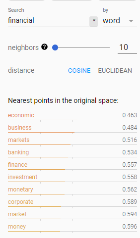
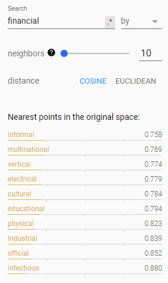

# CS 224n: Assignment #5

## 1

### (a)

&emsp;&emsp;Embedding size used for character-level embeddings is typically lower than that used for word embeddings. I guess the possible reason is that the size of chars-vocabulary is much smaller that the size of word-vocabulary. That means we don't need more dims to represent a concrete chars.

### (b)

&emsp;&emsp;For char-based embedding, total params:
$$
V_{char} \times e_{char} + e_{word} \times k \times e_{char} + 2 \times(e_{word} \times e_{word} + e_{word})
$$
&emsp;&emsp;First product is embedding lookup, second is convolution operation, third is Highway network
&emsp;&emsp;For word-based embedding, total params:
$$
V_{word} \times e_{word}
$$

&emsp;&emsp;If $k = 5, V_{word} ≈ 50,000$ and $V_{char} = 96$. It's obvious that word embedding model has more params and by $V_{word}$ the word embedding model is 100 times as many params as char-based model.

### (c)

&emsp;&emsp;As mentioned in lecture, one cell state or hidden state always be a mixture of the info from left and right, i.e. we get a fixed pattern or contextual info about one position. However, the filter of CNN just based on several words/chars in a window. That means we could not only make computation paralell but also have several filters to capture different feature/patterns we expect.

### (d)

&emsp;&emsp;This question may involve more knowledges about CNN. According to some theories, the error of features come from two aspects: $(1)$ increased variance of estimate caused by limited neighbourhood and $(2)$ the offset of mean caused by the error of params of conv layer. Max pooling could mitigate the first impact and preserve background info. Avg pooling could mitigate the second impact and retain texture.
&emsp;&emsp;In this question, we could have another eplaination for those two pooling methods.
&emsp;&emsp;**Max pooling**:

- Advantage: Get the strongest pattern in the data.
- Disadvantage: Discard most info in the data.

&emsp;&emsp;**Max pooling**:

- Advantage: Preseved all data info, because we make a average.
- Disadvantage: For other hand, if there is two many small values and only few big values, the strong signal dilutes and we just get a relatively small result(pattern or texture).

## 2

### (f)

$BLEU$ score is 24.36

## 3

### (a)

&emsp;&emsp;traducir and traduce are in word-vocabulary.
&emsp;&emsp;For word-based NMT, there may exist OOV problem while the decoder encounter word like 'traduzco' and decoder will predict 'unk' token.
&emsp;&emsp;The new char-aware NMT can overcome this problem because there is no 'unk' token in char-level vocab. While word-based NMT predict 'unk', char-level decoder takes it as input($h_0$ and $c_0$) to generate char sequence to replace 'unk' token.

### (b)

$\mathrm{i}.$

financial:

neuron:

Francisco:

naturally:

expectation:

$\mathrm{ii}.$

financial:

neuron:

Francisco:

naturally:

expectation:

$\mathrm{iii}.$

|word|Word2Vec|CharCNN|
|:-:|:-:|:-:|
|financial|economic|informal|
|neuron|nerve|Newton|
|Francisco|san|France|
|naturally|occurring|practically|
|expectation|norms|exception|

&emsp;&emsp;Word2Vec models the sematic similarity and CharCNN models the structure similarity.
&emsp;&emsp;Recall Word2Vec, it think simIlar words have similar context, i.e. a word is represented by its context, while CharCNN extract info from a window-based feature(vector/matrix), so these words similar in word structure will be close in feature space.

### (c)

$\mathrm{i}.$
1. Hoy estoy aqu para hablarles sobre crculos y epifanas.
2. I'm here today to talk to you  about circles and epiphanies.
3. I'm here to talk to you about circles and <unk>
4. I'm here today to talk about circles and <u>episodes</u>.
5. Incorrect example. episode and epiphanies are similar in word structure.

$\mathrm{i}.$

1. Bien, al da siguiente estbamos en Cleveland.
2. Well, the next day we were in Cleveland.
3. Well, the next day we were in <unk>
4. Well, the next day we were in <u>Cleveland</u>, right?
5. Acceptable. Maybe any word in corpus isn't similar to Cleveland except itself.

